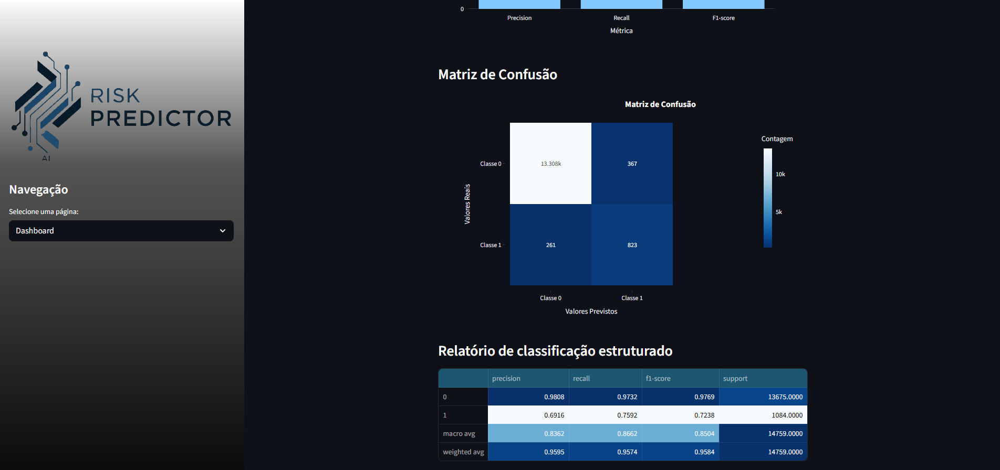

# default-risk-analysis

Este projeto foi desenvolvido como parte de um case técnico da Datarisk, com o objetivo de prever a inadimplência em cobranças mensais com base em dados cadastrais, histórico de pagamentos e perfil dos clientes. Conforme o enunciado do case, a proposta do desafio simula um cenário real dentro da empresa. Pensando nisso, foi criada uma interface interativa com Streamlit, que facilita a visualização dos dados, métricas e previsões de forma simples e acessível. A seguir, estão as informações sobre a estrutura do projeto e como executar os notebooks e a aplicação.

# Entendendo os diretórios

## `assets`

* Contém os arquivos de imagem utilizados para ilustrar o arquivo `README.md`.
  * **logo.png** e **mini-logo.png**: Logotipos da Datarisk usados na interface do Streamlit.
  * **pages.png**: Print da tela inicial da aplicação (para a documentação).
  * **dash.png**: Print da tela de dashboard com as métricas do modelo (para a documentação).
  * **risk-predict.png**: Print da tela do sistema de previsão de risco (para a documentação).

## `dashboard`

* **.streamlit**: Contém configurações específicas para execução do Streamlit (ex: layout, tema, etc).
* **pages**: Contém os códigos Python das páginas da aplicação Streamlit.
* **app.py**: Arquivo principal que inicializa e gerencia a aplicação interativa em Streamlit.

## `data`

* **processed**: Contém os dados já tratados, prontos para uso nos modelos e na aplicação.

  * **dataset\_features\_v1.csv**: Dataset final com todas as features preparadas.
  * **merged\_dataset.csv / merged\_test.csv**: Bases unificadas com variáveis derivadas e estruturadas.
  * **submissao\_case.csv**: Resultado final da previsão sobre a base de teste com as probabilidades de inadimplência.
  * **test\_features\_v1.csv**: Base de teste com as mesmas features da base de treino.
  * **resultados\_grid\_search\_v6.pkl**: Resultados do tuning de hiperparâmetros com GridSearchCV.
  * **final\_random\_forest\_structure.pkl**: Estrutura do modelo Random Forest salva em disco.
  * **cleaned\_base\_cadastral.csv / cleaned\_base\_info.csv**: Bases intermediárias tratadas.
* **raw**: Contém os dados brutos originais fornecidos no início do projeto.

  * **base\_cadastral.csv**
  * **base\_info.csv**
  * **base\_pagamentos\_desenvolvimento.csv**
  * **base\_pagamentos\_teste.csv**

### `notebooks`

* **exploratory\_analysis.ipynb**: Notebook com a análise exploratória inicial e tratamento dos dados.
* **feature\_engineering.ipynb**: Notebook responsável pela construção das features finais
* **modeling.ipynb**: Pipeline de treinamento e avaliação dos modelos de machine learning (Random Forest, XGBoost, LightGBM e Logistic Regression).
* **predict\_test\_data.ipynb**: Script de inferência na base de teste e geração do arquivo final de submissão.

## `src`

Contém os scripts principais utilizados para pré-processamento e previsão pelo dashboard interativo:

* **model_utils.py**: Define funções relacionadas ao carregamento do modelo e à execução das previsões.
* **preprocessing.py**: Contém as funções responsáveis pelo tratamento dos dados, também para a aplicação Streamlit.

## Arquivos adicionais

* **.gitignore**: Arquivo de configuração para ignorar arquivos temporários e pesados no repositório.
* **requirements.txt**: Lista de bibliotecas necessárias para rodar a aplicação.

---

# Como rodar?

Siga os seguintes passos para executar a aplicação localment. **Lembre-se de rodar todos os comandos na raiz do projeto e esteja utilizando um ambiente com Python 3.10**:

1. **Instalação das dependências:**

   Certifique-se de estar usando **Python 3.10** no seu ambiente. Para instalar as dependências:

   ```bash
   pip install -r requirements.txt
   ```
2. **Organização dos dados:**

   Certifique-se de que os dados brutos estejam no diretório **/data/raw**. Utilize os notebooks para gerar os arquivos processados em **/data/processed**.
3. **Execução dos notebooks (é necessário executá-los nesta ordem):**

   1. Execute o notebook **/notebooks/exploratory\_analysis.ipynb** para a exploração e tratamento inicial dos dados e gerar os arquivos das bases processadas em **/data/processed**.
   2. Execute o notebook **/notebooks/feature\_engineering.ipynb** para gerar as features.
   3. Em seguida, execute o notebook **/notebooks/modeling.ipynb** para treinar os modelos e salvar as métricas e resultados.
   4. Por fim, rode o notebook **/notebooks/predict\_test\_data.ipynb** para gerar as previsões sobre os dados de teste.
4. **Executar a aplicação Streamlit (dashboard interativo):**

   Certifique-se de estar na **raiz do projeto** e de que **todos os notebooks responsáveis pela geração dos dados processados já foram executados** antes de iniciar a aplicação Streamlit. Para iniciar a aplicação, execute o seguinte comando:

   ```bash
   streamlit run ./dashboard/app.py
   ```

# Navegação pela interface

A aplicação Streamlit possui uma barra lateral de navegação no lado esquerdo, permitindo acessar as diferentes seções do projeto. Abaixo, descrevemos como interagir com cada uma das telas:

**Tela Inicial:**

Esta é a página principal, que apresenta um resumo do case técnico e do objetivo do projeto.


1. **Selecione uma página:** No topo da barra lateral, há um menu dropdown chamado "Selecione uma página:". Clique nele para visualizar as opções de navegação: "Início", "Dashboard" e "Sistema Risk Predict".
2. **Navegação:** Clique em cada uma das opções para acessar as respectivas páginas da aplicação.

**Tela de Dashboard:**

Esta página exibe alguns gráficos de exploração dos dados após todos os tratamentos realizados neles e também informações do desempenho dos modelos testados.



1. **Visualização:** Ao acessar a página "Dashboard" através do menu de navegação, você poderá visualizar algumas análises dos dados.
2. **Relatório de Classificação:** Há também informações específicas de desempenho dos modelos testados como da matriz de confusão e relatório de classificação, com métricas importantes como precisão, recall, f1-score e suporte para cada classe e para as médias macro e ponderada.

**Tela de Sistema Risk Predict:**

Esta página permite realizar previsões de risco de inadimplência através do upload de um arquivo CSV.


1. **Upload do CSV:** Na seção "Upload do CSV", você encontrará uma área para arrastar e soltar o arquivo CSV contendo os dados a serem previstos. O arquivo deve seguir o formato especificado, com colunas separadas por ponto e vírgula (`;`) e com as colunas: `ID_CLIENTE`, `SAFRA_REF`, `DATA_EMISSAO_DOCUMENTO`, `DATA_VENCIMENTO`, `VALOR_A_PAGAR` e `TAXA`. O limite de tamanho por arquivo é de 200MB. Você também pode clicar em "Browse Files" para selecionar o arquivo através do explorador de arquivos do seu sistema.
2. **Arquivo Carregado:** Após o upload, o nome do arquivo aparecerá abaixo da área de upload. Você pode remover o arquivo carregado clicando no ícone de "X" ao lado do nome do arquivo.
3. **Realizando a previsão:** Após carregar o arquivo e selecionar a coluna de imputação, a aplicação iniciará automaticamente o processo de leitura e previsão dos dados. Uma barra de progresso "Realizando a previsão..." será exibida.
4. **Download dos resultados:** Ao final do processamento, um botão de download será disponibilizado para você baixar um arquivo CSV contendo as previsões de risco de inadimplência para os dados fornecidos. Será gerado também um gráfico de dispersão da inadimplência para os registros atualizados e um gráfico de pizza com o percentual de amostras com probabilidade igual ou maior a 50% de inadimplência.
